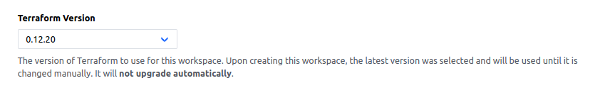
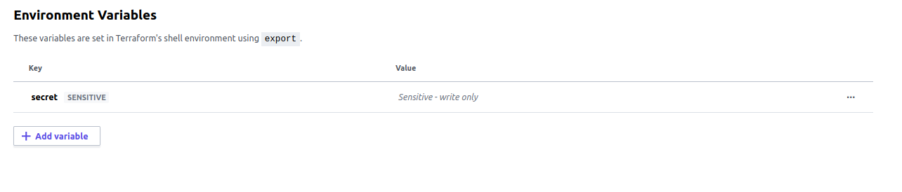
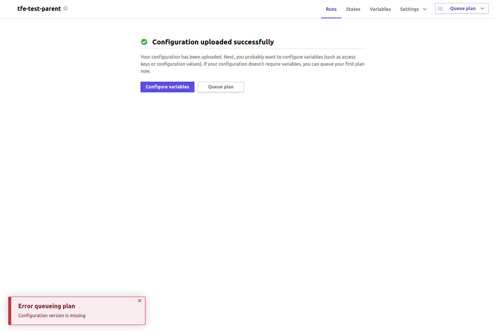

# TFE Test

This repository tests a setup of a TFC workspace ("child"), managed by a TFC workspace ("parent") using tfe_provider. The parent operations are all perfomed with Terraform 0.13.0. Note I have redacted sensitive values with \<VARIABLE> notation.

1. Create a new child workspace:

```sh
cd child
terraform init
```

2. Set the child workspace to use Terraform 0.12.0 (do this via TFC interface)



3. Create a secret environment variable in the child workspace using the TFC interface called "secret" with a value of "123"



4. Initialize the parent workspace with tfe_provider to manage the child

```sh
cd parent
terraform init
```

5. Import the organization into the parent workspace

```sh
cd parent
terraform import tfe_organization.myorg <TRC_ORG>
```

6. Import the existing child workspace into the parent

```sh
cd parent
terraform import module.child.tfe_workspace.space <TFC_WORKSPACE_ID>
```

7. Get the secret Id of the "secret" env variable in the child workspace

```sh
curl -s --header "Authorization: Bearer <TOKEN>" --header "Content-Type: application/vnd.api+json" https://app.terraform.io/api/v2/workspaces/<WORKSPACE>/vars | jq '.data[]'
```


8. Import the existing child secret variable into the parent

```sh
cd parent
terraform import module.child.tfe_variable.secret <TFC_ORG>/tfe-test-child/<SECRET_ID>
```

9. Run terraform apply to create a local version of the parent, which will now manage the child workspace. Apply the update to the secret value as required.

```sh
cd parent
terraform apply
```

10. Update the parent to use a TFC workspace by editing `parent/main.tf`

```hcl
// Terraform config
terraform {
  backend "remote" {
    hostname = "app.terraform.io"
    organization = "<TFC_ORG>"
    workspaces {
      name = "tfe-test-parent"
    }
  }
}
```

11. Run terraform init to copy over the local parent state to the TFC workspace (enter Yes when asked to copy existing state)

```sh
cd parent
terraform init
```

12. Run terraform plan

```sh
cd parent
terraform plan
```

output:

```sh
Waiting for the plan to start...

Terraform v0.13.0

------------ Terraform Cloud System Message ------------

Terraform Cloud detected a terraform.tfstate file in your working
directory: ./terraform.tfstate

The presence of this file causes a state migration error which prevents
Terraform from running successfully. To fix this error please migrate
your local terraform.tfstate to Terraform Cloud and make sure the
the file is deleted.

For step by step instructions on how to migrate your terraform.tfstate
file from Terraform Open Source to Terraform Cloud, please see:

   https://www.terraform.io/docs/enterprise/migrate/index.html

--------------------------------------------------------
```

13. Attempt to clean up by moving old tfstate files

```sh
cd parent
mv terraform.tfstate terraform.tfstate.backup /tmp
```

14. Try plan again

```sh
cd parent
terraform plan
```

15. Plan now runs, but wants to create the secret variable which has already been imported into managed state (**this shouldn't be in the plan**)

```sh
An execution plan has been generated and is shown below.
Resource actions are indicated with the following symbols:
  + create

Terraform will perform the following actions:

  # module.child.tfe_variable.secret will be created
  + resource "tfe_variable" "secret" {
      + category     = "env"
      + hcl          = false
      + id           = (known after apply)
      + key          = "secret"
      + sensitive    = true
      + value        = (sensitive value)
      + workspace_id = "<WORKSPACE_ID>"
    }

Plan: 1 to add, 0 to change, 0 to destroy.
```

16. Alternatively try running on TFC using "Queue plan" button

Returns "Error queueing plan - Configuration version is missing"



17. Summary, state is not uploaded to the TFC parent properly?
